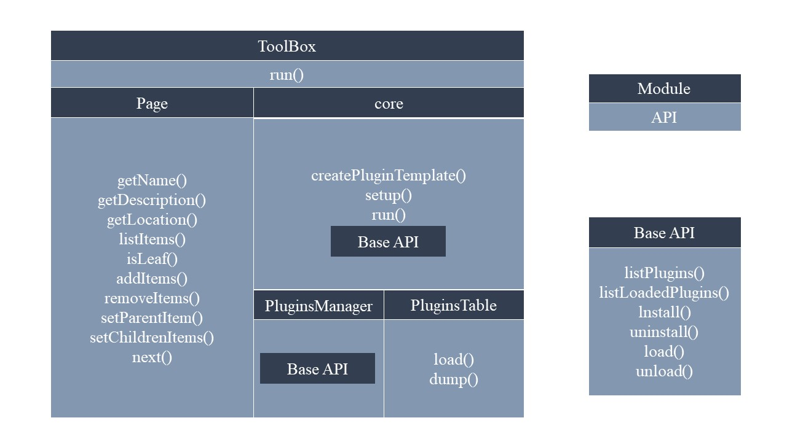
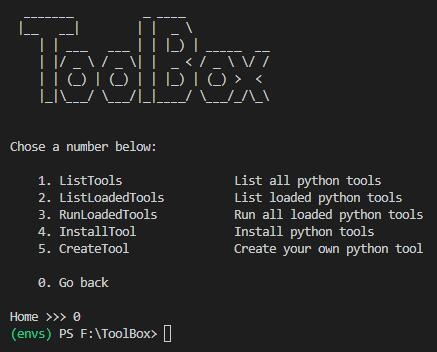

```
 _______          _ ____            
 |__   __|        | |  _ \           
    | | ___   ___ | | |_) | _____  __
    | |/ _ \ / _ \| |  _ < / _ \ \/ /
    | | (_) | (_) | | |_) | (_) >  < 
    |_|\___/ \___/|_|____/ \___/_/\_\                       by bananalone
```

# 前言  
ToolBoxWithTools是包含了自用python工具的工具盒子，长期更新

纯净版ToolBox请前往 [https://github.com/bananalone/ToolBox](https://github.com/bananalone/ToolBox) 获取

# 现有工具
1. XorEncryption &nbsp;&nbsp; 使用异或运算对文件或者目录下的所有文件加密解密

# 架构
  
- **Page** &nbsp;&nbsp; 显示界面类，包括换页（分支节点）和绑定事件函数（叶子节点）
- **core** &nbsp;&nbsp; 实现ToolBox的基本功能，包括设置插件运行参数、运行插件、插件管理以及创建插件模板
- **PluginsManager** &nbsp;&nbsp; 插件管理，包括列出所有已安装插件、获得所有已加载插件、安装、删除、装载和卸载
- **PluginsTable** &nbsp;&nbsp; 插件状态序列化

# 使用方法
```
python /path/to/src/main.py
```

# 界面

  